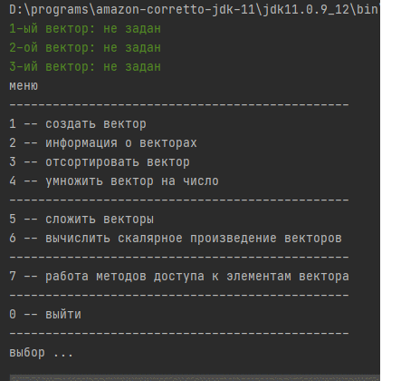
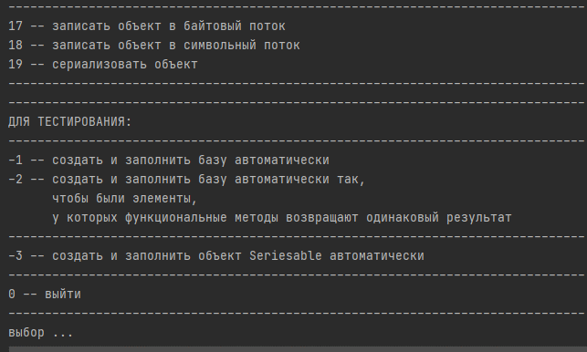
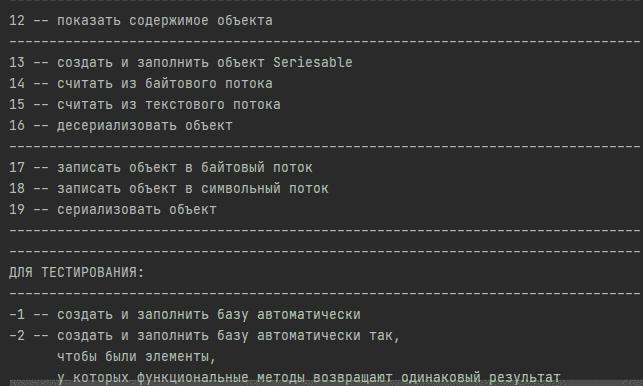
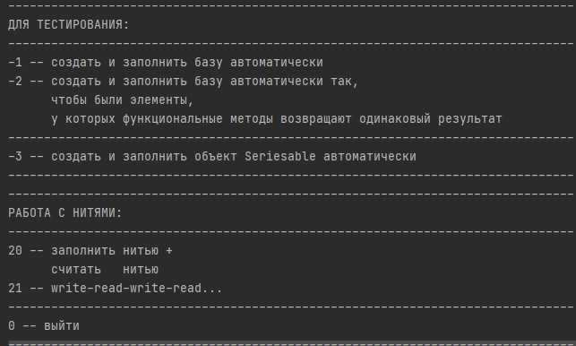
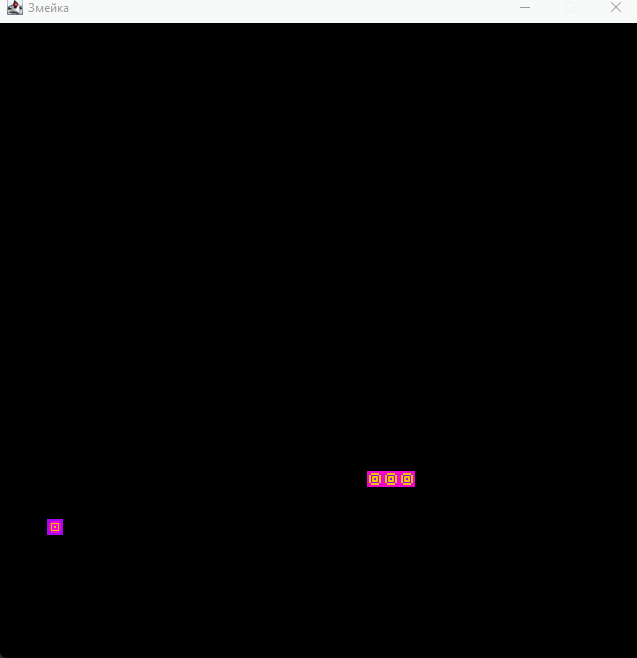
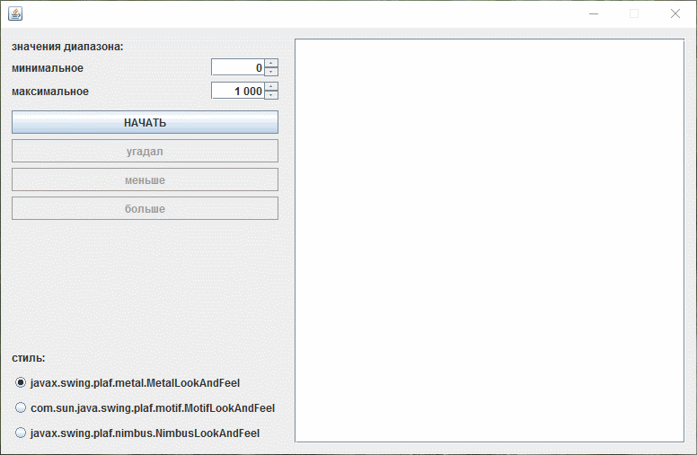
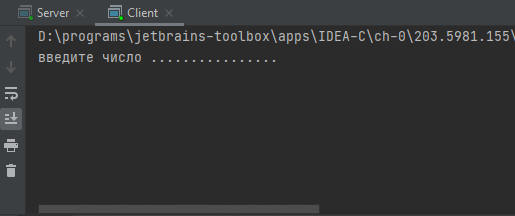
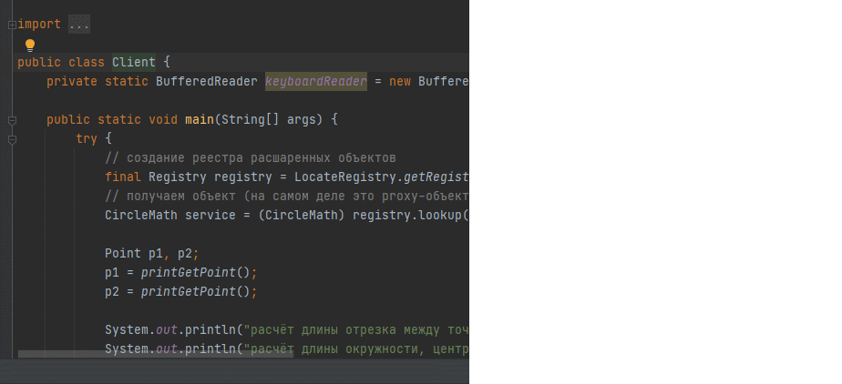
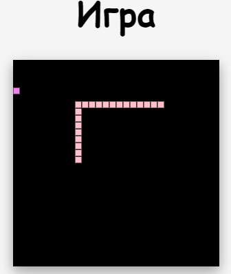

# Спецкурс по Java (2019)

2. [ООП](#lab2)
3. [Интерфейсы и исключения](#lab3)
4. [Ввод и вывод](#lab4)
5. [Многопоточность](#lab5)
6. [Образцы проектирования](#lab6)
7. [Swing и Plaf. Угадайка и Змейка](#lab7)
8. [Sockets](#sockets)
9. [RMI](#rmi)
10. [Servlets](#servlets)
11. [JDBC](#jdbc)

## ООП <a name="lab2"></a>
Знакомство с основными конструкциями языка Java, принципами создания классов.



### Описание
Создан класс, реализующий работу с векторами (набор вещественных чисел, координат) и базовые операции векторной арифметики. Класс удовлетворяет следующим требованиям:
  * Экземпляр соответствовует вектору фиксированной длины (она задаётся как параметр конструктора).
  * Реализованы следующие методы:
    * доступа к элементам вектора (получения значения и изменения значения);
    * получения «длины» вектора (количества его элементов);
    * поиска минимального и максимального значений из элементов вектора;
    * сортировки вектора (по возрастанию и убыванию);
    * нахождения евклидовой нормы;
    * умножения вектора на число;
    * сложения двух векторов;
    * нахождения скалярного произведения двух векторов.

## Интерфейсы и исключения <a name="lab3"></a>
Знакомство с концепцией интерфейсов и исключительными ситуациями в Java.
### Описание
1. Описаны два класса с идентичным внешним представлением, принадлежащие одной предметной области. Оба класса содержат:
* поле — массив, поле строкового типа, поле целого типа;
* конструктор по умолчанию и конструктор с параметрами, позволяющие полностью инициализировать объект;
* методы доступа к элементам массивов и к полям;
* функциональный метод, реализующий некоторую функцию от элементов массива и полей объектов классов.
2. Описан интерфейс, задающий список сигнатур методов доступа к полям объектов и функционального метода, оба класса реализовывают интерфейс.
3. В классах переопределены методы класса Object: toString(), equals(), hashCode().
4. Организована база (массив) объектов типа интерфейс, которая заполняется объектами описанных типов вперемежку (по желанию пользователя). Возможны следующие действия:
* вывод полной информации обо всех объектах массива;
* поиск в массиве объектов, функциональный метод которых возвращают одинаковый результат, и помещение таких объектов в другой массив; 
* разбиение исходного массива на два массива, в которых хранятся однотипные элементы;
5. При описании классов описано одно объявляемое (наследное от Exception) и одно необъявляемое (наследное от RuntimeException) исключения, характеризующие ошибки, связанные с выполнением методов классов. В соответствующих методах выбрасываются/контролируются описанные исключения.
### Cемантика
Класс «Серия сочинений» (поле — массив хранит количество страниц в каждой книге серии, второе поле — название серии, третье поле — количество страниц в книге, занятых вводной информацией, функциональный метод — подсчёт общего количества страниц серии без учёта вводных страниц книг) и класс «Сборник статей» (поле — массив хранит количество страниц каждой статьи, второе поле — название сборника, третье поле — максимально допустимое количество страниц для аннотации статьи, функциональный метод — подсчёт общего количества страниц без учёта аннотаций статей).

## Ввод и вывод <a name="lab4"></a>
Знакомство с механизмом ввода/вывода в Java.






### Описание
1. Модифицированы классы из Лабораторной работы №4 следующим образом:
* в интерфейс добавлены следующие методы:
  * записи в байтовый поток void output(OutputStream out);
  * записи в символьный поток void write(Writer out);
  * реализованы добавленные в интерфейс методы в обоих классах;
* описан класс со следующими статическими методами:
  * записи в байтовый поток void output<Интерфейс>(<Интерфейс> o, OutputStream out);
  * чтения из байтового потока <Интерфейс> input<Интерфейс>(InputStream in);
  * записи в символьный поток void write<Интерфейс> (<Интерфейс> o, Writer out);
  * чтения из символьного потока <Интерфейс> read<Интерфейс>(Reader in).

В статических методах записи делегирован вызов соответствующему методу интерфейса.
В обоих случаях записанный объект представляет собой последовательность значений своих полей.

2. Модифицированы классы в иерархии таким образом, что сериализуемы.
Добавлены в класс со статическими методами методы для вывода/ввода сериализованных объектов:
* вывод сериализованных объектов void serialize<Интерфейс> (<Интерфейс> o, OutputStream out);
* ввод десериализованного объекта <Интерфейс> deserialize<Интерфейс>(InputStream in).
3. Организован примитивный интерфейс пользователя (заполнение базы элементов с консоли, выбор типа элемента пользователем). Протестированы разработанные методы работы с потоками, а также возможности сериализации.

## Многопоточность <a name="lab5"></a>
Знакомство с общими принципами создания многопоточных приложений.



### Задание 1
Созданы два класса нитей, наследующие от класса Thread, взаимодействующие друг с другом с помощью промежуточного объекта типа интерфейс из ЛР3.

Первая нить последовательно заполняет поле-массив промежуточного объекта произвольными различными величинами. Каждый раз, когда она помещает значение в массив, она выводит на экран сообщение вида “WRITE ### TO POSITION ###”. По достижении конца массива нить заканчивает своё выполнение.

Вторая нить последовательно считывает значения из массива и выводит их на экран сообщениями вида “READ ### FROM POSITION ###”. По достижении конца массива нить заканчивает своё выполнение.

В методе main() созданы 3 участвующих в процессе объекта (две нити и объект интерфейса для записи/чтения в него).
### Задание 2
Созданы два новых класса нитей (реализуют интерфейс Runnable), обеспечивающие последовательность операций чтения-записи (т.е. на экран сообщения выводятся в порядке write-read-write-read-…) независимо от приоритетов потоков. Для этого описан некий вспомогательный класс <Интерфейс>Synchronizer, объект которого используется при взаимодействии нитей.
### Задание 3
Добавлена в класс со статическими методами обработки объектов (созданный в ЛР4) реализация метода <Интерфейс> synchronized<Интерфейс> (<Интерфейс> i), возвращающий ссылку на оболочку указанного интерфейса, безопасная с точки зрения многопоточности. Для этого описан новый класс, реализующий интерфейс <Интерфейс> и представляющий собой оболочку, синхронизирующую все методы интерфейса (состоящая из синхронизированных методов интерфейса).

# Многопоточность. File Type Analyzer

Утилита, которая извлекает информацию о типе файла (используя алгоритм Кнута-Морриса-Пратта) для определения типа файла.

Программа принимает шаблоны типов файлов и путь к папке с файлами и сопоставляет шаблон с некоторым файлом.

Программа организована в виде нескольких потоков-работников.
Каждый “работник” эквивалентен логически однопоточному сопоставителю шаблонов типов файлов: работник берёт несколько файлов и последовательно сопоставляет их, используя алгоритм поиска.
Ответы каждого работника будут суммированы как общий результат выполнения.

#### Пример вывода

```
java Main test_files patterns.db
doc_0.doc: MS Office Word 2003
doc_1.pptx: MS Office PowerPoint 2007+
doc_2.pdf: PDF document
file.pem: PEM certificate
```

## Образцы проектирования <a name="lab6"></a>
Знакомство с механизмом образцов проектирования «Итератор», «Декоратор» и упрощённой версией «Фабричного метода».
### Задание 1
Модифицирован интерфейс таким образом, чтобы он реализовывал интерфейс java.util.Iterable.

Реализован метод java.util.Iterator iterator(), унаследованный из интерфейса, в двух классах. Для этого описан дополнительный класс итератора с соответствующими методами итератора (из стандартного интерфейса java.util.Iterator). Объект итератора возвращается из метода iterator() классов. Итератор позволяет обойти все элементы поля-массива.
### Задание 2
Проверена работа итератора (с использованием улучшенного цикла for).
### Задание 3
Добавлено в класс со статическими методами описание ещё одного статического метода <Интерфейс> unmodifiable<Интерфейс>(<Интерфейс> о), возвращающего ссылку на экземпляр неизменяемой оболочки указанного объекта. Для этого описан новый класс-декоратор для типа <Интерфейс>, который содержит объект типа <Интерфейс>, сам реализует <Интерфейс>, а все методы интерфейса делегирует внутреннему объекту, кроме методов изменения объекта. Декоратор выбрасывает исключение UnsupportedOperationException в случае попытки изменения состояния внутреннего объекта.
### Задание 4
Описан новый интерфейс <Интерфейс>Factory, содержащий единственный метод createInstance() для создания экземпляра по умолчанию.
### Задание 5
В классе со статическими методами создано приватное статическое поле factory типа <Интерфейс>Factory и соответствующий ему публичный метод set<Интерфейс>Factory, позволяющие, соответственно, хранить ссылку и устанавливать ссылку на текущую фабрику объектов. Для каждого типа объекта из иерархии нужно описан класс соответствующей фабрики (реализующей метод createInstance()). По умолчанию поле ссылается на объект одного из двух класса Factory, порождающего экземпляры одного из классов.
### Задание 6
В классе со статическими методами описан метод public static createInstance(), с помощью текущей фабрики создающий новый экземпляр объекта. В остальных методах прямое создание экземпляров заменено на вызов этого метода.

## Свинг. Угадайка <a name="lab7"></a>
Знакомство с технологией Swing, обработкой событий и PLaF.





### Задание 1
Написано оконное Swing-приложение для игры в «больше-меньше». Игра заключается в следующем: пользователь загадывает число из указанного диапазона, приложение пытается его угадать. На каждое предположение приложения о загаданном числе пользователь указывает, является ли загаданное число больше, меньше, или приложение угадало. 

Приложение реализовано со следующей функциональностью:
* ввод минимального и максимального значений диапазона, из которого пользователь может загадать число;
* предположение приложения о загаданном пользователем числе;
* указание пользователя, является ли предположенное число больше или меньше загаданного;
* вывод завершающего сообщения о победе и предложение сыграть ещё раз;
* вывод завершающего сообщения о жульничестве и предложение сыграть ещё раз.

### Задание 2
Добавлена на форму радиокнопка на несколько позиций, соответствующих различным доступным PLaF. При выборе пользователем одного из предлагаемых значений изменяется внешний вид программы.

## Разработка клиент-серверного приложения с применением сокетов на Java <a name="sockets"></a>
В процессе написания заданий ознакомиться с базовыми принципами создания клиент-серверных приложений, основанных на применении сокетов.



### Задание 1
Реализовать клиентскую часть приложения в методе main() отдельного класса. Приложение-клиент устанавливает через сокет соединение с приложением-сервером, после чего циклически передает серверному приложению два целых числа и ждет от него результат целочисленного деления первого числа на второе и остаток от деления. Формат передачи можно выбрать самостоятельно (в битовом виде, в символьном виде, через сериализацию).

### Задание 2
Реализовать (в отдельном модуле компиляции) серверную часть приложения в рамках модели последовательной обработки запросов.
Логика функционирования серверного приложения следующая: серверное приложение принимает запрос от приложения-клиента, получает от него целые числа парами, вычисляет результат деления и остаток. Если вторым числом получен ноль (деление вызовет ошибку), то серверное приложение отправляет клиенту сообщение об ошибке. Формат сообщений должен соответствовать формату, выбранному в задании 1.

### Задание 3
Реализовать (в отдельном модуле компиляции) серверную часть приложения в рамках модели параллельной обработки запросов.

## Разработка RMI-приложения архитектуры «клиент-сервер» <a name="rmi"></a>



### Задание 1
Написать сериализуемый класс Point, хранящий координаты точки на плоскости (x, y). Предусмотреть конструктор для создания объектов класса Point, методы доступа для установки и получения значений координат точки.

### Задание 2
Написать серверное RMI-приложение (т.е. написать класс серверного объекта, его интерфейс, класс серверного приложения и пр.), реализующее обработку координат двух точек на плоскости, описываемых объектами класса Point. Серверный объект выполняет следующие функции: 
* расчет длины отрезка между точками;
* расчет длины окружности, центром которой является одна из точек, а радиусом – расстояние между точками;
* расчет площади круга, центром которого является одна из точек, а радиусом – расстояние между точками;
* расчет длины окружности, диаметром которой является расстояние между точками;
* расчет площади круга, диаметром которого является расстояние между точками.

Параметрами методов серверного объекта являются два объекта класса Point.

### Задание 3
Написать консольное клиентское приложение, получающее доступ к удаленному объекту и выполняющее на нем действия по обработке двух точек, координаты которых вводятся пользователем с клавиатуры.

## Разработка веб-приложения архитектуры «клиент-сервер» с использованием технологии Servlets и JSP <a name="servlets"></a>
В процессе написания тестовых заданий ознакомиться с простейшими тегами языка HTML, технологиями Java Servlets, JSP.

### Задание 1
* Создать простое Web-приложение, состоящее из страницы index.html и файла с изображением (image.jpg).
* В качестве Web-сервера и Application-сервера можно воспользоваться сервером GlassFish (поставляется вместе с NetBeans и предлагается по умолчанию).
* Файл image.jpg должен содержать изображение любой семантики и может быть создан, например, с помощью графического редактора.
* Файл index.html создается средствами NetBeans и должен содержать текстовое приветствие (Hello World!) в виде заголовка (тег h1), две копии изображения (тег img) из файла image.jpg, разделенных переводами каретки (тег br), а также надпись «Click here to download picture», где слово here должно быть ссылкой на файл image.jpg.
* Рекомендуется удалить из проекта файл index.jsp и изменить welcome-file в дескрипторе развертывания web.xml.
* Запустите приложение, просмотрите результат в браузере. Попробуйте скачать файл, кликнув по ссылке.

### Задание 2
Создайте сервлет, формирующий графический файл и привязанный к URL «/image.jpg» (сам файл с этим названием удалите из проекта). Тип отклика сервлета должен быть «image/jpg». Осуществите соответствующую настройку дескриптора развертывания (или задайте соответствующие аннотации классу сервлета).

Изображение (640х120) должно содержать надпись “Hello World!”, написанную шрифтом Times New Roman (bold, 72pt) на координатах (100, 100). Цвет надписи должен быть произвольным (случайным).

Классы, которые потребуются для создания изображения:
* java.awt.Color (цвет графического примитива);
* java.awt.Font (шрифт);
* java.awt.Graphics (канва для рисования, содержит метод drawString());
* java.awt.image.BufferedImage (изображение, размер и тип задаются в конструкторе, тип определяется одной из констант класса);
* javax.imageio.ImageIO (содержит статические методы ввода и вывода изображений в байтовые потоки);
* java.util.Random (генератор псевдослучайных чисел, содержит метод nextInt(256)).

Запустите приложение, просмотрите результат в браузере. Попробуйте скачать файл, кликнув по ссылке. Попробуйте скачать файл повторно и сравните результат. Попробуйте также несколько раз обновить страницу в браузере.

Примечание. Сервлет может создавать графический файл с альтернативным содержимым.

### Задание 3
Написать простое веб-приложение, основанное на технологии JSP и реализующее простой калькулятор. В состав приложения должно входить как минимум две jsp-страницы.

Первая страница должна выводить форму, содержащую два текстовых поля ввода для чисел, а также 4 кнопки с арифметическими операциями. По нажатии одной из кнопок должна выводиться эта же страница, только в нижней ее части следует вывести выполненную операцию и ее результат (например, «4 * 4 = 16»). При этом в полях ввода должны сохраняться прежние значения.

Вторая страница должна служить сообщением об ошибке и предоставлять возможность перехода на исходную страницу. Для настойки страницы ошибки использовать соответствующий атрибут директивы %@page.

## Servlet Змейка <a name="servletsnake"></a>

### ПОДРОБНЕЕ – servlet-snake.pdf



# Задание
Написать распределённое клиент-серверное приложение, используя указанную технологию распределенной объектной обработки. 
Приложение реализует игру «Змейка» со следующими правилами:
* в игре присутствует один игрок-пользователь;
* пользователь управляет движущимся объектом (змейкой);
* змейка выполняет задания серверного приложения (например, пересечь заданную точку на экране, выполнить заданную траекторию и т.д.);
* при успешном выполнении задания игрок получает некоторое вознаграждение (например, змейка увеличивается, игрок получает баллы и т.д.);
* игра прекращается при нарушении которых ограничений игры (например, выход за границу игрового поля, пересечение змейкой самой себя, и т.д.).

## Изучение технологии JDBC <a name="jdbc"></a>
Изучение технологии JDBC – настройка взаимодействия Java-приложения и СУБД.

### Задание 1
Описать базу данных, состоящую из двух связанных таблиц (минимально по 3 столбца в каждой, в первой -- первичный ключ и внешний ключи обязательны, во второй -- первичный ключ). Для реализации использовать имеющуюся СУБД (MsSql, MySql, Oracle, PostGRE). Предметную область данных в БД выберите самостоятельно (можно воспользоваться таблицами из создаваемых ранее баз данных).

### Задание 2
Установить необходимый JDBC-драйвер. Изучить параметры соединения Java-приложения к разработанной БД выбранной СУБД через JDBC-драйвер.

### Задание 3
Написать приложение, взаимодействующее с БД по технологии JDBC, реализовать следующую функциональность:
1) вывод на экран всех строк первой таблицы, присоединив к ним соответствующие строки второй таблицы (эквисоединение первичный ключ-внешний ключ);
2) возможность добавления записей во вторую таблицу;
3) возможность добавления записей в первую таблицу (с выбором по внешнему ключу связанной записи из второй таблицы);
4) возможность удаления записей второй таблицы по ключу без нарушения целостности данных из первой таблицы (с запросом на удаление записи из первой таблицы, при запрете такого удаления удаление из второй таблицы не выполнять);
5) возможность удаления записи из первой таблицы по ключу.

Для реализации первых трёх пунктов использовать обычные SELECT и UPDATE-запросы, для реализации четвертого и пятого пунктов использовать параметризованный запрос (речь идёт о соответствующих интерфейсах в JDBC!!!). Разработать адекватный пользовательский интерфейс.
Продемонстрировать результаты работы.

